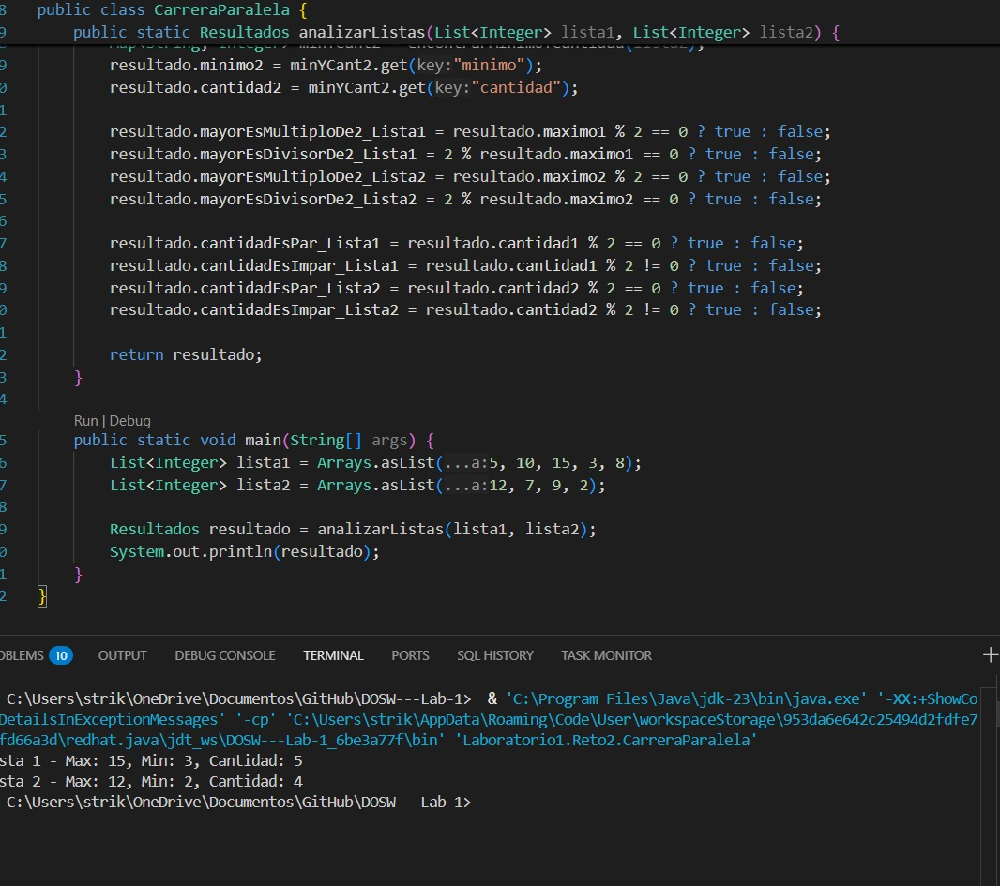

DOSW LAB#1

PROPIETARIOS

* Ignacio Castillo
* Diego Rodriguez

RESPUESTAS

**1. ¿Cómo se utiliza y para qué sirve el comando git add?**
R: El comando git add se usa en Git para preparar archivos antes de confirmarlos (commitearlos) al repositorio.

**2. ¿Cómo se utiliza y para qué sirve el comado git commit -m?**
R: sirve para crear un commit (una confirmación de cambios) en Git y guardar esos cambios en el historial del repositorio junto con un mensaje descriptivo.

**3. ¿Hay una mejor forma de trabajar con git para no tener conflictos?**
R: a

**4. ¿Qué es y como funciona el Pull Request?**
R: e

## Retos:

### Reto 1

### Reto 2

### Reto 3

### Reto 4

### Reto 5

### Reto 6

