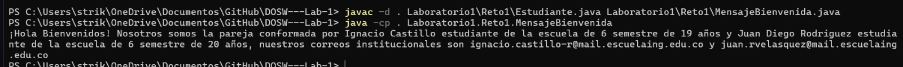
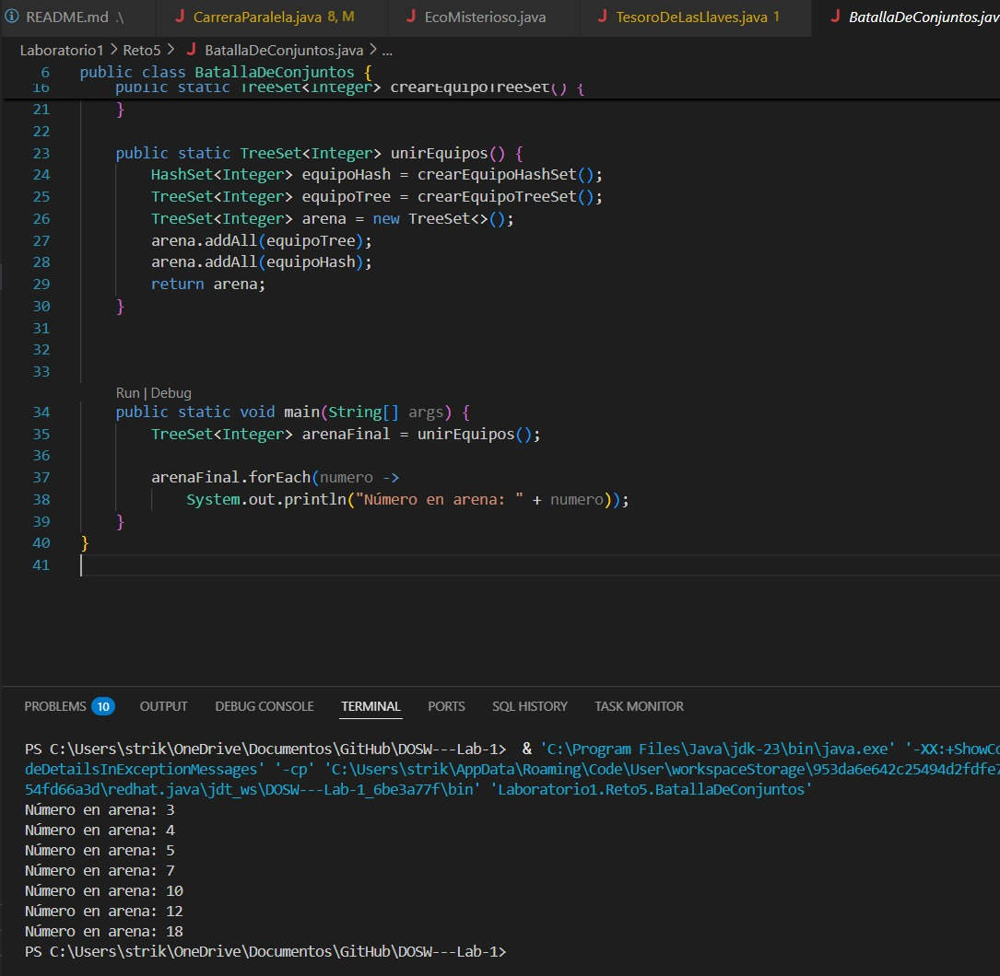

DOSW LAB#1

PROPIETARIOS

* Ignacio Castillo
* Juan Diego Rodriguez

RESPUESTAS

**1. 쮺칩mo se utiliza y para qué sirve el comando git add?**
R: El comando git add se usa en Git para preparar archivos antes de confirmarlos (commitearlos) al repositorio.

**2. 쮺칩mo se utiliza y para qué sirve el comado git commit -m?**
R: sirve para crear un commit (una confirmación de cambios) en Git y guardar esos cambios en el historial del repositorio junto con un mensaje descriptivo.

**4. 쯈ue sucedió al intentar subir los cambios al mismo tiempo?**
R: Aparece un error en la pantalla de una de las dos personas evitando que haga el pull. 

**4. 쮿ay una mejor forma de trabajar con git para no tener conflictos?**
R: No, pero hay practicas que reducen en gran parte la posibilidad, como lo son: mantener la rama actualizada con main, hacer commits pequeños y coordinar con el equipo para no editar mismas partes del codigo y si se hace, ser coordinados.(o hacer pair programming en el mismo pc :))

**5. 쯈ué es y como funciona el Pull Request?**
R: Es una solucitud para fusionar cambios de una rama a otra, permite que el equipo revise, comente y apruebe antes de integrarlo en la rama deseada.
 🦅🦅🦅🦅🦅
 
 
## Preguntas Parte 3

### 1. 쮺uál es la diferencia entre git merge y git rebase?

git merge: Combina ramas creando un commit de merge, preservando la historia de ambas ramas.
git rebase: Mueve commits de una rama encima de otra, creando una historia lineal sin commits de merge.

### 2. Si dos ramas modifican la misma línea de un archivo 쯈ué sucede al hacer merge?

Se produce un conflicto de merge. Git marca las secciones conflictivas y requiere resolución manual antes de completar el merge.

### 3. 쮺칩mo puedes ver gráficamente el historial de merges y ramas en consola?

git log --oneline --graph --all o git log --graph --pretty=oneline --abbrev-commit

### 4. Explica la diferencia entre un commit y un push?

commit: Guarda cambios localmente en el repositorio local.
push: Envía commits locales al repositorio remoto.

### 5. Para que sirve git stash y git stash pop?

git stash: Guarda temporalmente cambios no confirmados.
git stash pop: Restaura los cambios guardados y elimina el stash.

### 6. Qué diferencia hay entre HashMap y HashTable?

HashMap: No sincronizado, permite null, más rápido.
HashTable: Sincronizado (thread-safe), no permite null, más lento.

### 7. Qué ventajas tiene Collectors.toMap() frente a un bucle tradicional para llenar un mapa? 

Collectors.toMap() es más conciso, declarativo y seguro que un bucle, permite definir cómo resolver claves duplicadas, elegir el tipo de Map, y funciona con parallel streams, mientras que con un bucle hay que programar todo eso manualmente.

### 8. Si usas List con objetos y luego aplicas stream().map() que tipo de operación estas haciendo? 

stream().map() es una operación intermedia de transformación que aplica una función a cada elemento y devuelve un nuevo Stream con los resultados, pudiendo cambiar el tipo de los elementos.

### 9. Que hace el método stream().filter() y que retorna? 

stream().filter() aplica un predicado lógico y devuelve un Stream solo con los elementos que cumplen la condición, no altera la colección original y se evalúa cuando se aplica una operación terminal.

### 10. Describe el paso a paso de cómo crear una rama desde develop si es una funcionalidad nueva. 

Actualizamos develop con git pull, luego creas y cambias a la nueva rama con git checkout -b feature/nombre, trabaja allí, hace commit y la sube al remoto para finalmente integrarla con un merge o pull request.

### 11. 쮺uál es la diferencia entre crear una rama con git branch y con git checkout -b? 

Git branch nombre solo crea la rama pero te deja en la actual, mientras que git checkout -b nombre la crea y además te cambia a ella en un solo paso.

### 12. 쯇or qué es recomendable crear ramas feature/ para nuevas funcionalidades en lugar de trabajar en main directamente? 

Porque aíslan el desarrollo, protegen la rama main estable, permiten revisiones y trabajo en paralelo, y facilitan mantener un historial limpio y controlado.

## Retos:

### Reto 1

### Reto 2

### Reto 3

### Reto 4

### Reto 5

### Reto 6

**Bibliografía**

1. GitHub Guides. Git Add. Recuperado de GitHub: https://github.com/git-guides/git-add

2. GitHub Guides. Git Commit. Recuperado de GitHub: https://github.com/git-guides/git-commit

3. Atlassian. Making a Pull Request. Recuperado de Atlassian: https://www.atlassian.com/git/tutorials/making-a-pull-request

4. GitHub Docs. Resolver un conflicto de fusión en GitHub. Recuperado de GitHub: https://docs.github.com/es/pull-requests/collaborating-with-pull-requests/addressing-merge-conflicts/resolving-a-merge-conflict-on-github

5. Atlassian. Git merge conflicts. Recuperado de Atlassian: https://www.atlassian.com/git/tutorials/using-branches/merge-conflicts

